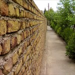
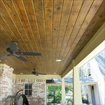
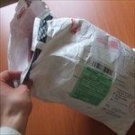
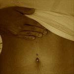
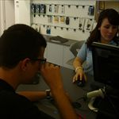
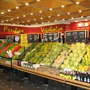
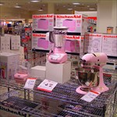

# A2 单词表

| 图片 | 单词 | 词性 | 释义 | 例句 | 近义词 | 反义词 |
| :----: | --- | ---- | ---- | ---- | ---- | ---- |
|  | gemelo | s., m. | 双胞胎 | Estos gemelos tienen los ojos claros. | mellizo | |
|  | portero | s., m. | 门卫 | El portero está delante de la puerta. | conserje, bedel | |
|  | vecino | s., m. | 邻居 | Todos los días me saluda mi vecino. | | |
|  | nervioso | adj., m. | 紧张的 | Mi hermano está muy nervioso cuando tiene un examen. | excitado, exaltado, inquieto | tranquilo, sereno |
|  | bañera | s., f. | 浴缸 | La chica está dentro de la bañera con espuma. | | |
|  | invitado | s., m. | 客人 | Julia tiene cuatro invitados a su fiesta de cumpleaños. | | |
|  | pared | s., f. | 墙 | La pared es de ladrillos. | tabique, muro | |
|  | amueblado | adj., m. | 有家具的 | La habitación está amueblada: tiene una mesa, silla, estantes, etcétera. | | |
|  | techo | s., m. | 屋顶，天花板 | El techo de la casa es de madera. | cubierta, tejado | |
|  | visitar | v., tr. | 拜访，探望 | Juan visita a su madre cada semana. | saludar | |
|  | fábrica | s., f. | 工厂 | El chico trabaja en una fábrica de productos de limpieza. | factoría, empresa | |
|  | pedido | s., m. | 订单 | A Pedro ya le ha llegado el pedido de camisetas. | encargo, petición, demanda | |
|  | generoso | adj., m. | 大方的 | Mateo es muy generoso y siempre me da a probar su comida. | desprendido | tacaño, egoísta |
|  | egoísta | adj., m./f. | 自私的 | El dueño del coche es muy egoísta porque ha aparcado en dos lugares. | egocéntrico, tacaño | generoso, desprendido |
|  | regalar | v., tr. | 送礼物 | La mujer regala un ramo de flores a su madre. | obsequiar, dar | cobrar, vender |
|  | bote | s., m. | 瓶子 | Estos botes de colores no tienen nada dentro. | frasco, tarro | |
|  | mermelada | s., f. | 果酱 | A nosotros nos encanta la mermelada de frambuesa. | confitura | |
|  | goloso | adj., m. | 爱吃甜食的 | La niña es muy golosa. Siempre está comiendo chocolate. | | |
|  | dulce | s., m. | 糖果 | A los niños les vuelven locos los dulces. | chuchería | |
|  | ingrediente | s., m. | 成分，原料 | El tomate es uno de los ingredientes del gazpacho andaluz. | componente | |
|  | hambre | s., f. | 饥饿 | El perro espera la comida porque tiene hambre. | apetito | desgana |
|  | hacerse la boca agua | expr. col. | 流口水 | A Violeta se le hace la boca agua al pensar en la pizza que va a comer. | | |
|  | estómago | s., m. | 肚子 | A Silvia le duele un poco el estómago. | | |
|  | anciano | s., m. | 老年人 | El anciano se divierte jugando a la peonza. | mayor, viejo, abuelo | joven |
|  | cliente | s., m. | 顾客 | La chica atiende al cliente rápidamente. | | |
|  | grandes almacenes | s., m. | 百货公司 | El Mercado de la Seda son los grandes almacenes más conocidos de Pekín. | | |
|  | en efectivo | expr. | 现金支付 | Yo siempre pago mis compras en efectivo. | en metálico | con tarjeta |
|  | traer | v., tr. | 带来 | El camarero nos trae las bebidas a la mesa. | aproximar, acercar | llevar, alejar |
|  | pesar | v., intr. | 称重 | La chica pesa 75 kilos. | | |
|  | certificado | s., m. | 证书 | La chica muestra su certificado de finalización del curso. | título, documento, diploma | |
|  | sección | s., f. | 部门，部分 | Nosotros estamos comprando en la sección de frutas y verduras del supermercado. | departamento | |
|  | devolver | v., tr. | 归还，退货 | El niño devuelve el balón al chico que está jugando a fútbol. | retornar, reembolsar (aplicado a dinero) | retener, quedarse |
|  | tarjeta | s., f. | 卡 | Esta persona tiene muchas tarjetas de crédito. | | |
|  | cheque | s., m. | 支票 | Él va al banco a cobrar un cheque por su trabajo. | talón | |
|  | electrodoméstico | s., m. | 电子产品 | En esta tienda venden electrodomésticos de color rosa. | | |
|  | preocupado | adj., m. | 担心的 | Ella está preocupada por los resultados de sus exámenes. | | |
