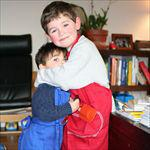
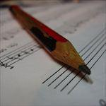
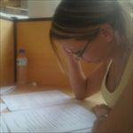
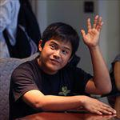
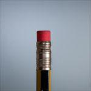
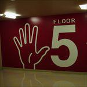
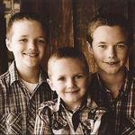
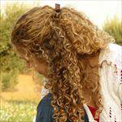

# 单词表

----

- **A1U1**

| 图片 | 单词 | 词性 | 释义 | 例句 | 近义词 | 反义词 |
| :---: | --- | ---- | ---- | ---- | ---- | ----- |
|  | nombre | s., m. | 名字 | Mi nombre es Isabel. | identidad | |
|  | apellido | s., m. | 姓 | Mi apellido es Martínez. | nombre de familia | |
|  | abecedario | s., m. | 字母表 | El abecedario español tiene 27 letras. | alfabeto | |
|  | saludar | v.,  tr. | 问候 | La niña saluda con la mano. | | despedirse |
|  | beso | s., m. | 亲吻 | Te mando un beso. | | |
|  | abrazo | s., m. | 拥抱 | Los hermanos se dan un fuerte abrazo. | | |
|  | alfabeto | s., m. | 字母表 | El alfabeto español tiene 27 letras. | abecedario | |
|  | escribir | v., tr. | 写 | Ana escribe en su libreta. | redactar |
|  | despedirse | v., tr./intr. | 告别 | Ellas se despiden con un abrazo. | | saludar |
|  | profesor | s., m. | 教授 | Él es profesor de matemáticas. | maestro |
|  | asignatura | s., f. | 课程 | La asignatura favorita de los estudiantes es informática. | materia, disciplina | |
|  | pizarra | s., f. | 黑板 | Peter escribe en la pizarra. | encerado | |
|  | tiza | s., f. | 粉笔 | Esta tiza es de color amarillo. | gix (en México) | |
|  | rotulador | s., m. | 油性笔 | El rotulador de la izquierda es de color amarillo. | | |
|  | ordenador | s., m. | 电脑 | La pantalla del ordenador es de color azul. | computadora (en Argentina) | |
|  | bolígrafo | s., m. | 圆珠笔 | Yo escribo con bolígrafo. | lapicera (en Argentina) | |
|  | lápiz | s., m. | 铅笔 | Este lápiz no es nuevo. | lapicero, grafito | |
|  | diccionario | s., m. | 字典 | Yoshi busca una palabra en su diccionario japonés- inglés. | léxico, enciclopedia | |
|  | escuchar | v., tr. | 听 | El niño escucha música. | percibir, oír | |
|  | estudiar | v., tr. | 学习 | Esta chica estudia mucho. | aprender, memorizar | |
|  | examen | s., m. | 考试 | Hoy hay examen de la asignatura. | prueba, ejercicio |
|  | difícil | adj.,  m./f. | 困难的，困难 | Este salto es muy difícil. | complicado | fácil, sencillo |
|  | biblioteca | s., f. | 图书馆 | Yo estudio en la biblioteca de la Universidad. | | |
|  | preguntar | v., tr. | 提问 | El estudiante pregunta al profesor en clase. | interrogar, cuestionar | contestar, responder |
|  | compañero | s., m. | 伙伴，伴侣 | Ana, Jose y Roberto son compañeros de clase. | colega | |
|  | cita | s., f. | 约会 | Luis tiene cita con el dentista. | encuentro
|  | director | s.m. | 经理，总管 | El señor Hervás es el director de la Universidad. | jefe | |
|  | goma | s., f. | 橡皮擦 | Este lápiz tiene goma de borrar. | | |
|  | cero | s., m. | 零 | Esta cerveza es cero por ciento alcohol. | | |
|  | uno | s., m. | 一 | En el puesto número uno está el ganador. | | |
|  | dos | s., m. | 二 | El ascensor está en el piso número dos. | | |
|  | tres | s., m. | 三 | Ella señala el número tres. | | |
|  | cuatro | s., m. | 四 | La carta tiene el número cuatro. | | |
|  | cinco | s., m. | 五 | Estamos en el piso número cinco. | | |
|  | seis | s., m. | 六 | La camiseta lleva el número seis. | | |
|  | siete | s., m. | 七 | Hoy estamos a día siete. | | |
|  | ocho | s., m. | 八 | La bola de billar tiene el número ocho. | | |
|  | nueve | s., m. | 九 | La carta es es el nueve de picas. | | |
|  | bombero | s., m. | 消防员 | El bombero utiliza agua. | | |
|  | fotógrafo | s., m. | 摄影师 | El fotógrafo trabaja con la cámara. | | |
|  | mecánico | s., m. | 技师 | El mecánico prepara el coche. | | |
|  | taxista | s., m./f. | 出租车司机 | El taxista conduce su taxi.
|  | sueldo | s., m. | 工资，薪水 | Hoy recibo mi sueldo del mes. | salario | |
|  | mapa | s., m. | 地图 | Yo busco un lugar en el mapa. | plano | |
|  | contratar | v., tr. | 雇用 | Ellos contratan al chico para trabajar en el supermercado. | fichar | despedir |
|  | dedicarse | v., tr. | 从事 | Ellos se dedican a la medicina. | trabajar | |
|  | recepcionista | s., m./f. | 接待员 | La recepcionista atiende el teléfono.
|  | tienda | s., f. | 商店 | Esta tienda es de ropa. | | |
|  | estar en paro | expr. | 失业 | Estas dos personas están en paro y buscan trabajo. | estar desempleado/a | |
|  | supermercado | s., m. | 超市 | Ellos compran en el supermercado. | | |
|  | abuelo | s., m. | 祖父 | Este es mi abuelo. Se llama Vicente. | | |
|  | hermano | s., m. | 兄弟 | En esta foto estamos mis hermanos mayores y yo. | | |
|  | hijo | s., m. | 儿子 | El hijo de Rosana tiene 7 años. | | |
|  | novio | s., m. | 男朋友 | El novio de Laura es muy simpático. | pareja, chico/a | |
|  | corto | adj., m. | 短的 | Este pantalón es corto. | pequeño | largo |
|  | largo | adj., m. | 长的 | Ella viste un vestido largo para la fiesta. | grande, amplio | largo |
|  | moreno | adj., m. | 深色皮肤或头发的（人） | Estas personas son muy morenas de piel. | | |
|  | rubio | adj., m. | 金色头发的（人） | Marylin Monroe es una de las rubias más famosas. | | |
|  | romántico | adj., m. | 浪漫的 | Este chico es muy romántico. | apasionado | |
|  | casarse | v., intr. | 结婚 | Ellos compran en el supermercado. | desposarse | divorciarse, separarse |
|  | inteligente | adj., m./f. | 聪明的 | Albert Einstein es una persona inteligente. | listo | tonto, ignorante |
|  | rizado | adj., m. | 卷发的 | La chica de la foto tiene el pelo rizado. | ondulado | liso |
